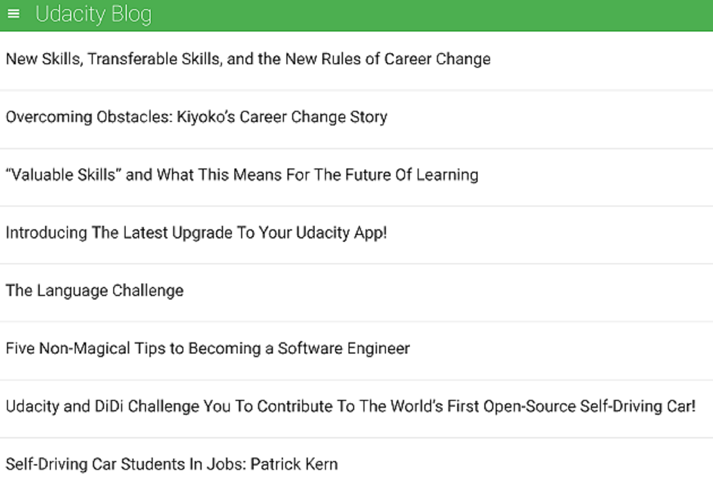
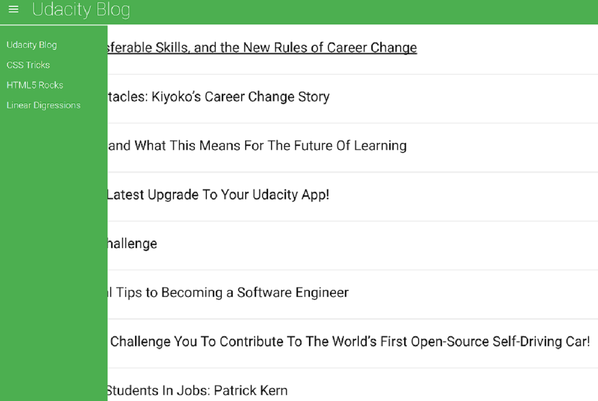

[//]: # (Image References)

[image1]: ./feedReader1.PNG
[image2]: ./feedReader2.PNG

Project Overview

This is a web-based application that reads RSS feeds. The app also includes jasmine tests for the app features like, feed loading, menu toggle.

 | 
